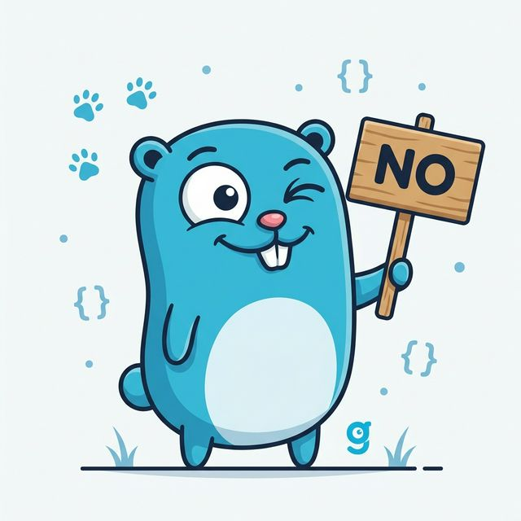

# Deny By Default as a Service



Ever needed a graceful way to say “no”?  
This API returns random, generic, creative, and sometimes hilarious rejection reasons (and acceptances!); perfectly suited for any scenario: personal, professional, student life, dev life, or just because.

Built for humans, excuses, and humor.

## Sponsored by GitAds
[](https://gitads.dev/v1/ad-track?source=rajathjn/deny-by-default-as-a-service@github)

## How to Use

You can run this project easily using Docker Compose, or by building the Go application directly.

### Running with Docker Compose

1. Clone the repository.
2. Run the following command in the root of the project:
   ```bash
   docker-compose up -d
   ```
3. The API will be available at `https://localhost` (Thanks to Caddy).

### Running Locally with Go

1. Make sure you have Go installed.
2. Clone the repository and navigate into the project directory.
3. Run the application:
   ```bash
   go run main.go

   or

   go build -o dbdaas main.go
   ./dbdaas
   ```
4. The API will be available at `http://localhost:8080`.

## API Usage

**Method:** `GET`

### Endpoints

- `/` - Returns a random "no" reason.
- `/no` - Returns a random "no" reason.
- `/yes` - Returns a random "yes" reason.
- `/random` - Returns a random "yes" or "no" reason.
- `/health` - Health check status.
- **Catch-All (`/*`)** - Any other route not defined above will return a positive "yes" reason.

### Content Negotiation

By default, the API responds with plain text. You can request JSON responses by either:
1. Adding the `?format=json` query parameter.
2. Setting the `Accept: application/json` or `Content-Type: application/json` header.

### Examples

**Plain Text (Default)**
```bash
$> curl localhost:8080/no
I'm busy achieving a new high score in introversion.
```

**JSON via Query Parameter**
```bash
$> curl "localhost:8080/yes?format=json"
{"reason":"Sounds great, let's do it!","type":"yes"}
```

**JSON via Headers**
```bash
$> curl localhost:8080/random -H "Content-Type: application/json"
{"reason":"I am stuck in a time loop of saying no.","type":"no"}
```

### Rate Limiting

The API includes built-in rate limiting to prevent abuse. When running via Docker Compose, you can configure these environment variables on the `dbdaas` service:
- `RATE_LIMIT` (Requests per second)
- `BURST_LIMIT` (Maximum burst size)

## Author
Created by [Rajath](https://github.com/rajathjn).

## License
This project is licensed under the MIT License.
Do whatever, just don’t say yes when you can say no. Unless you want to 😉.

See the [LICENSE](LICENSE) file for details.
